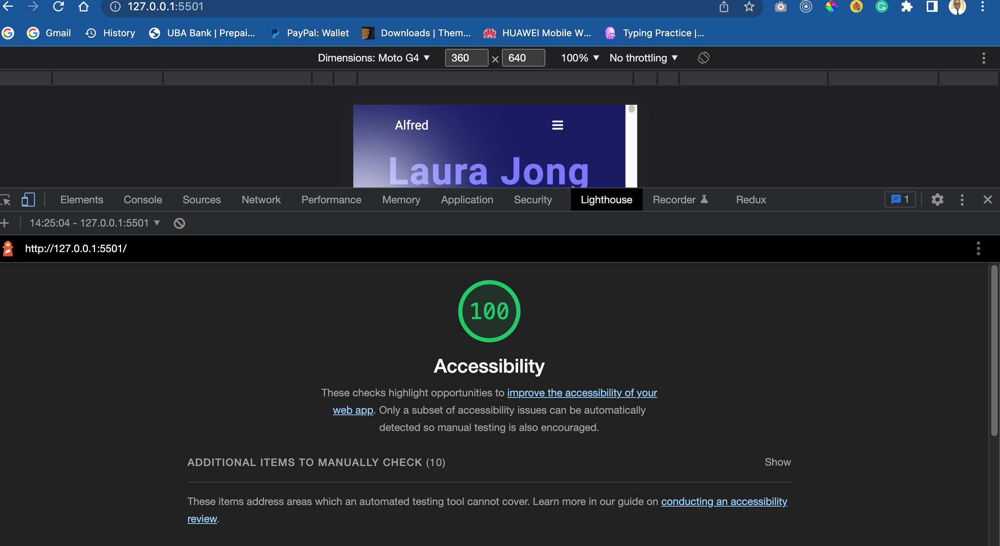

# My Portfolio Website

### Description

This is my portfolio website to show employers and hiring managers what am are capable of doing and the projects I have build so far.

## Accessibility Report

### This is the accessibility report 

- Page titles - `No issue found.`

- Images text alternatives - `No issues found`

- Headings `No Issues found`git 

- Contrast - `There was an issue with my bottom background , but i have fixed them` [LineFixedIssue]()

- Resize - `There was an issue with page resizing. But it has been fixed`

- Interaction - `There were no labels with the forms. But Labels has been added for screen readers only`

- Moving content - `No issues found`

- Multimedia - `No issues found`

- The basic structure of the page  - `No Issues found`

## Built With

- HTML
- CSS

## Getting Started

To get a local copy up and running follow these simple example steps.

### Prerequisites

- Node
- Git
- Code Editor

### Setup

- Clone the repository
- Change directory into the project folder
- Install dev dependencies
- Open project with text editor to view changes
- Run the code using [live server](https://www.google.com/search?client=safari&rls=en&q=live+server&ie=UTF-8&oe=UTF-8)

## Deployment

Webpage has been deployed to github pages

## Live Demo

[Live Demo Link](https://learnwithalfred.github.io/portfolio-website/)

## Author

Alfred Boateng

- GitHub: [@learnwithalfred](https://github.com/learnwithalfred)
- Twitter: [@kb_alfred](https://twitter.com/kb_alfred)
- LinkedIn: [Alfred Boateng](https://www.linkedin.com/in/alfred-boateng-704670138/)

## 🤝 Contributers

- Diego Hernández: [@diegoh40](https://github.com/diegoh40)
- Dino Ronald Quispe Arias [@dqarias](https://github.com/dqarias)

# Contributor's codes

[Diego Hernández's](https://github.com/diegoh40/Diego-Portfolio/pull/3)

[Dino Ronald Quispe Arias](https://github.com/dqarias/Portafolio.git)

## Show your support

Give a ⭐️ if you like this project!
